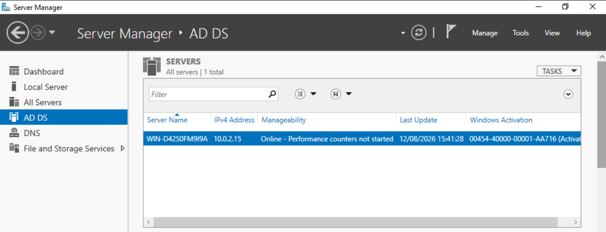
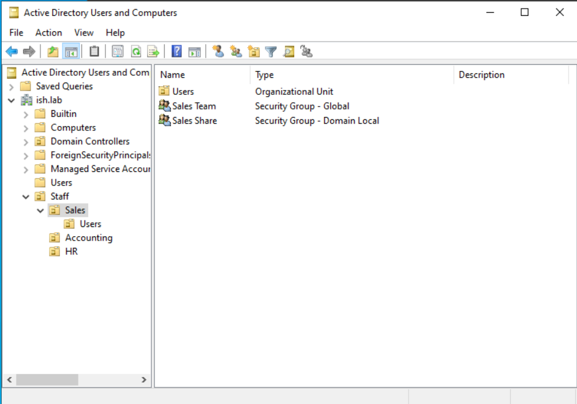
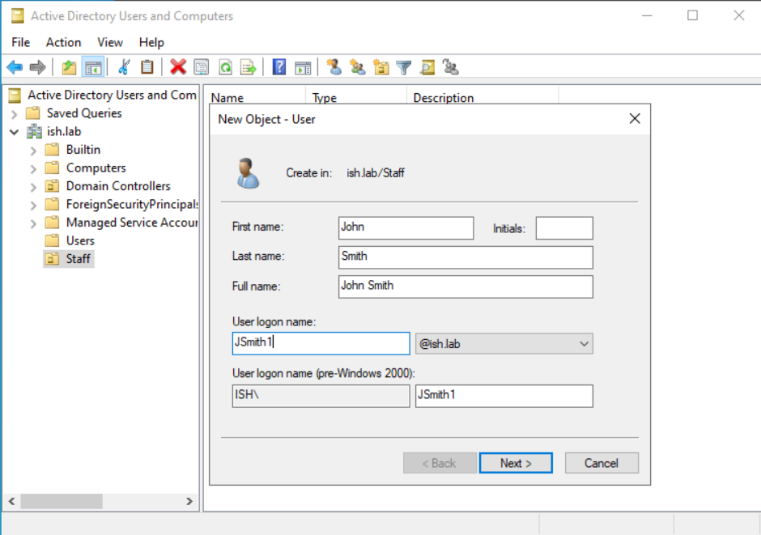
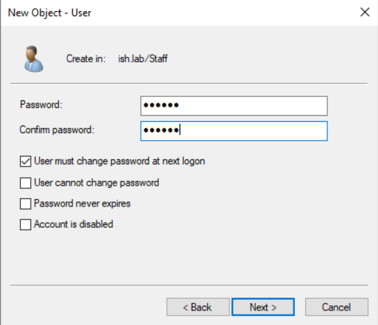
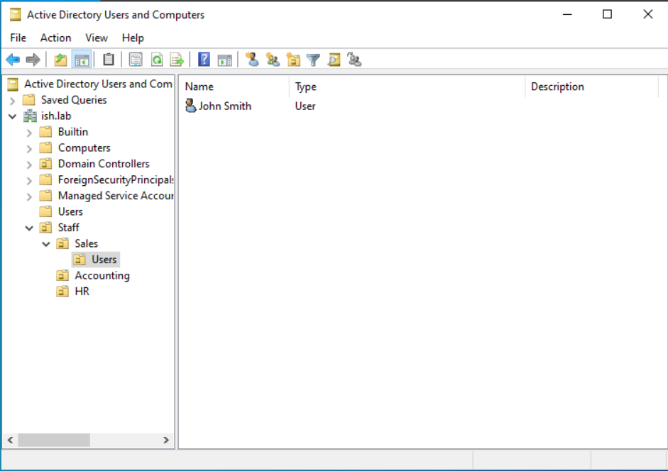
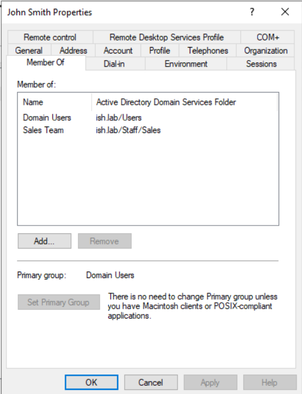
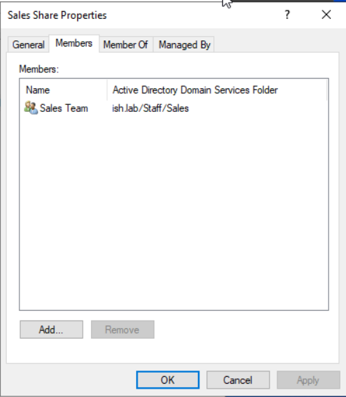
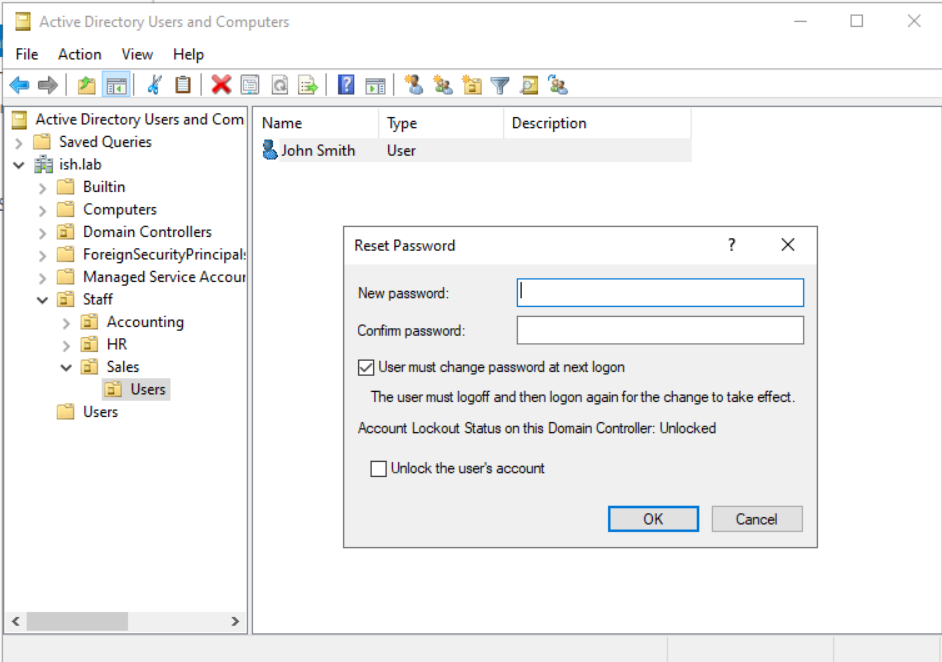
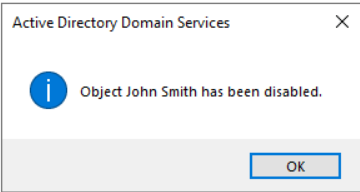

# Active Directory User Lifecycle Walkthrough

A documented walkthrough of core Active Directory user management tasks, covering the joiner, changer and leaver process using a self hosted Windows Server domain controller running in VirtualBox.

## Environment

- Windows Server (Evaluation)
- Active Directory Domain Services
- VirtualBox VM
- Domain: ish.lab

## 1. Active Directory Domain Services Setup

Installed and promoted the server to a domain controller for the domain ish.lab, confirmed as online and running through Server Manager.

## 2. Organisational Unit Structure

Structured the domain with departmental OUs, Sales, Accounting and HR, sitting under a parent Staff OU. This reflects how real organisations segment users by department, making it easier to apply group policy and manage permissions at a department level rather than individually.

## 3. New Starter: Creating a User Account

Created a new user account for a test starter, John Smith, within the Sales OU under Staff. Set an initial password and enabled "User must change password at next logon", standard practice so a new starter sets their own password on first login rather than continuing to use one set by IT.

## 4. Changer: Group Membership and Nested Permissions

Rather than a single flat group, structured permissions using a two tier group model:

- **Sales Team** (Global security group), holds the actual users, John Smith was added here based on department
- **Sales Share** (Domain Local security group), used to control access to resources, with Sales Team nested inside it as a member

This follows the standard AGDLP approach (accounts into global groups, global groups into domain local groups, permissions applied to the domain local group) commonly used in real AD environments to keep user assignment and resource permissions cleanly separated. It means department membership and resource access can be managed independently of each other.

## 5. Password Reset

Reset John Smith's password through Active Directory Users and Computers, with "User must change password at next logon" enforced again as standard practice following any administrative password reset.

## 6. Leaver: Disabling an Account

Disabled John Smith's account to immediately revoke access while retaining the account itself, standard practice for a leaver so the account can be audited or reviewed before deletion rather than removed immediately.

