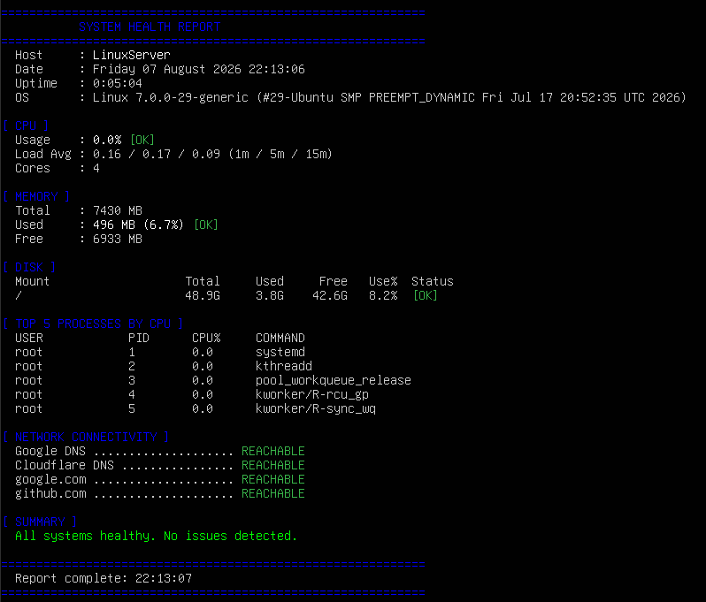

# Linux System Health Monitor

A Python script that generates a one-time system health report on any Linux machine. Built to demonstrate practical sysadmin and troubleshooting skills relevant to IT support roles.

## Screenshot



## What It Does

Runs a single report covering:

- **CPU** — current usage percentage and load average across all cores
- **Memory** — total, used, and free RAM with usage percentage
- **Disk** — usage across all mounted partitions with per-partition warning flags
- **Processes** — top 5 processes by CPU consumption
- **Network** — live connectivity check against 4 external hosts (Google DNS, Cloudflare, google.com, github.com)

Any metric exceeding the 80% warning threshold is flagged in red. A summary section at the bottom lists all issues found in one place.

## Why I Built This

First and second line IT support involves diagnosing system issues quickly — CPU spikes, memory pressure, full disks, and connectivity failures are among the most common problems a support technician investigates. This script automates that initial triage checklist and outputs a clear, colour-coded report, demonstrating both Linux CLI familiarity and practical troubleshooting thinking.

## Requirements

- Python 3
- psutil

## Installation & Usage

```bash
# Install dependency
sudo apt install python3-psutil

# Run the report
python3 system_health_monitor.py
```

## Example Output

```
============================================================
           SYSTEM HEALTH REPORT
============================================================
  Host     : LinuxServer
  Date     : Friday 07 August 2026 14:32:11
  Uptime   : 2 days, 4:12:33

[ CPU ]
  Usage    : 12%  [OK]
  Load Avg : 0.45 / 0.38 / 0.31 (1m / 5m / 15m)
  Cores    : 4

[ MEMORY ]
  Total    : 3934 MB
  Used     : 1823 MB (46.3%)  [OK]
  Free     : 2111 MB

[ DISK ]
  Mount                Total     Used     Free   Use%  Status
  /                   49.1G    18.3G    28.4G   37.3%  [OK]

[ SUMMARY ]
  All systems healthy. No issues detected.
============================================================
```

## Technologies Used

- Python 3
- psutil library
- Linux (tested on Ubuntu Server 24.04)
