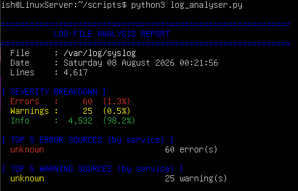

# Linux Log File Analyser

A Python script that parses Linux system log files, categorises entries by severity, identifies the most frequent error and warning sources, and outputs a structured diagnostic report. Built to demonstrate log analysis and fault diagnosis skills relevant to IT support roles.

## Screenshot



## What It Does

- **Severity breakdown** — counts and percentages of errors, warnings, and info entries across the entire log
- **Top 5 error sources** — identifies which services or processes are generating the most errors
- **Top 5 warning sources** — same for warnings
- **Recent errors** — displays the last 5 error entries for immediate context
- **Recent warnings** — displays the last 5 warning entries
- **Summary** — flags whether the log is clean or requires attention

Works against any standard syslog-format file: `/var/log/syslog`, `/var/log/auth.log`, `/var/log/kern.log`, and others.

## Why I Built This

Reading and interpreting system logs is one of the core skills in IT support and systems administration — when a service fails or a system behaves unexpectedly, the log file is the first place to look. This script automates the initial triage: rather than manually scrolling through thousands of lines, it surfaces the error sources and recent failures immediately, demonstrating both Python scripting ability and practical diagnostic thinking.

## Requirements

- Python 3 (no additional libraries required — uses standard library only)

## Installation & Usage

```bash
# Analyse the default syslog
python3 log_analyser.py

# Analyse a specific log file
python3 log_analyser.py --log /var/log/auth.log
python3 log_analyser.py --log /var/log/kern.log

# If permission is denied on system logs
sudo python3 log_analyser.py
```

## Example Output

```
============================================================
           LOG FILE ANALYSIS REPORT
============================================================
  File     : /var/log/syslog
  Date     : Friday 07 August 2026 14:45:22
  Lines    : 12,847

[ SEVERITY BREAKDOWN ]
  Errors   :     42  (0.3%)
  Warnings :    187  (1.5%)
  Info     : 12,618  (98.2%)

[ TOP 5 ERROR SOURCES (by service) ]
  systemd                           18 error(s)
  kernel                            11 error(s)
  NetworkManager                     8 error(s)
  snapd                              3 error(s)
  cron                               2 error(s)

[ SUMMARY ]
  ! 42 error(s) detected — review top error sources above.
  ! 187 warning(s) detected — review top warning sources above.
============================================================
```

## Technologies Used

- Python 3 (standard library only — `re`, `collections`, `argparse`, `datetime`)
- Linux (tested on Ubuntu Server 24.04)
- Compatible with any syslog-format log file
