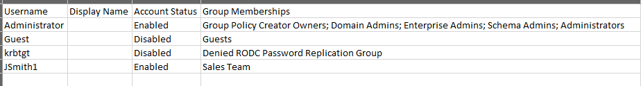

# Powershell scripting for Active Directory

A powershell script that outputs a report of all users, group memberships and disabled accounts to a CSV File on the desktop(configurable) for easy viewing and admin.



## The Script
```powershell
Import-Module ActiveDirectory

$ExportPath = "$env:USERPROFILE\Desktop\AD_Lab_User_Report.csv"

Get-ADUser -Filter * -Properties Enabled, MemberOf | ForEach-Object {
    
    # Transform the group array into a clean, semicolon-separated list of group names
    $GroupNames = $_.MemberOf | ForEach-Object { 
        (Get-ADGroup $_).Name 
    }
    $FlattenedGroups = $GroupNames -join "; "

    # Output a structured custom object for each user
    [PSCustomObject]@{
        "Username"         = $_.SamAccountName
        "Display Name"     = $_.DisplayName
        "Account Status"   = if ($_.Enabled) { "Enabled" } else { "Disabled" }
        "Group Memberships" = if ($FlattenedGroups) { $FlattenedGroups } else { "None" }
    }
} | Export-Csv -Path $ExportPath -NoTypeInformation -Encoding UTF8
```
